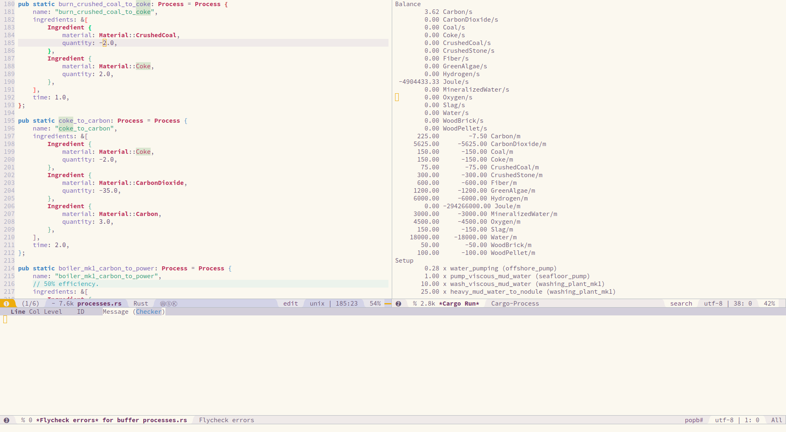
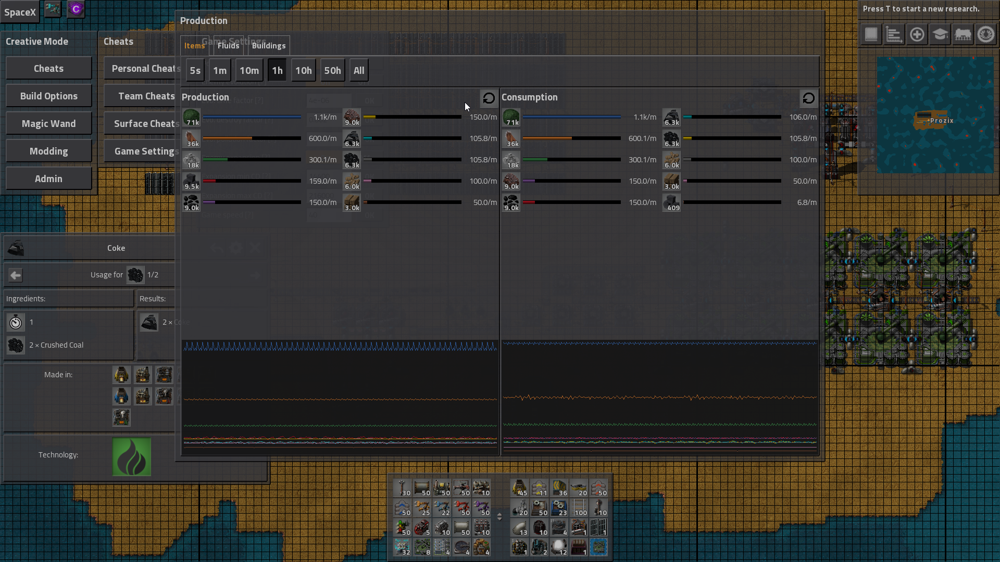
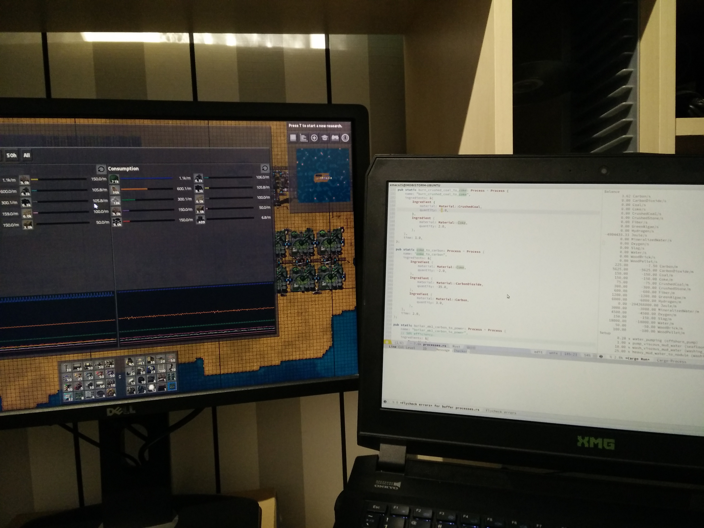

Factorio is one giant puzzle. Especially when you use Bobs' and Angels' mods.
Someone made a mod pack called Seablock taking the idea of the old Minecraft
SkyBlock maps where you start with almost nothing and have to figure out a way
to expand or reach some place.

Calculating the proportions in which you need certain machines/buildings
performing certain processes is very tedious and error prone. It is easy to
forget to factor in the correct crafting speed of the machine you intend to use,
forget a - sign somewhere, read/write a number wrong.

After I finally realized I was just solving a system of linear equations I
started to try and solve the problem with linear algebra. It took me a couple of
days to discover how to represent recipes. Then it took a couple more days to
discover how to set the quantity of some (machine, process) combination and how
to set the desired amount of materials.

When I finally got this done and implemented in Rust I built this setup in
Factorio to check how close my expected results were to the production graph of
Factorio. 


Unfortunately, my carbon output was not as high as I expected. By printing out
the expected production and consumption per minute I could find which resources
were and which weren't being calculated correctly.







I found out I had the crushed coal to coke recipe wrong. It shouldve been 2
crushed coal become 2 coke but I had it written down as 1 crushed coal becomes 2
coke.

So yeah, actually used basic linear algebra! Pretty cool :smile:.

```
early_energy_wood_pellet
Setup
        0.05 x water_pumping (offshore_pump)
        0.08 x burn_oxygen (flare_stack)
        0.10 x burn_hydrogen (flare_stack)
        1.00 x dirt_water_electrolysis (electrolyser_mk1)
        0.33 x stone_crushing (ore_crusher_mk1)
        0.07 x water_mineralization (liquifier_mk1)
        2.00 x green_algae_growing (algae_farm_mk1)
        0.80 x green_algae_to_fiber (liquifier_mk1)
        1.33 x fiber_to_wood_pellet (assembly_machine_mk1)
        0.19 x wood_pellet_to_carbon_dioxide (liquifier_mk1)
        0.63 x boiler_mk1_power (boiler_mk1_burning_wood_pellet)

Balance
 16247300.00 Joule/m

  Production  Consumption
      600.00      -600.00 CarbonDioxide/m
       60.00       -60.00 CrushedStone/m
      120.00      -120.00 Fiber/m
      240.00      -240.00 GreenAlgae/m
     1200.00     -1200.00 Hydrogen/m
 68571428.57 -52324128.57 Joule/m
      600.00      -600.00 MineralizedWater/m
      900.00      -900.00 Oxygen/m
       30.00       -30.00 Slag/m
     3600.00     -3600.00 Water/m
       20.00       -20.00 WoodPellet/m

early_energy_charcoal
Setup
        0.05 x water_pumping (offshore_pump)
        0.08 x burn_oxygen (flare_stack)
        0.10 x burn_hydrogen (flare_stack)
        1.00 x dirt_water_electrolysis (electrolyser_mk1)
        0.33 x stone_crushing (ore_crusher_mk1)
        0.07 x water_mineralization (liquifier_mk1)
        2.00 x green_algae_growing (algae_farm_mk1)
        0.80 x green_algae_to_fiber (liquifier_mk1)
        1.33 x fiber_to_wood_pellet (assembly_machine_mk1)
        0.17 x wood_pellet_to_wood_brick (assembly_machine_mk1)
        0.58 x wood_brick_to_charcoal (stone_furnace_burning_charcoal)
        0.27 x charcoal_to_carbon_dioxide (liquifier_mk1)
        0.80 x boiler_mk1_power (boiler_mk1_burning_charcoal)

Balance
 32902700.00 Joule/m

  Production  Consumption
      600.00      -600.00 CarbonDioxide/m
       60.00       -60.00 Charcoal/m
       60.00       -60.00 CrushedStone/m
      120.00      -120.00 Fiber/m
      240.00      -240.00 GreenAlgae/m
     1200.00     -1200.00 Hydrogen/m
 86850000.00 -53947300.00 Joule/m
      600.00      -600.00 MineralizedWater/m
      900.00      -900.00 Oxygen/m
       30.00       -30.00 Slag/m
     3600.00     -3600.00 Water/m
       10.00       -10.00 WoodBrick/m
       20.00       -20.00 WoodPellet/m

early_energy_partial_carbon
Setup
        0.05 x water_pumping (offshore_pump)
        0.08 x burn_oxygen (flare_stack)
        0.10 x burn_hydrogen (flare_stack)
        1.00 x dirt_water_electrolysis (electrolyser_mk1)
        0.33 x stone_crushing (ore_crusher_mk1)
        0.07 x water_mineralization (liquifier_mk1)
        2.00 x green_algae_growing (algae_farm_mk1)
        0.80 x green_algae_to_fiber (liquifier_mk1)
        1.33 x fiber_to_wood_pellet (assembly_machine_mk1)
        0.17 x wood_pellet_to_wood_brick (assembly_machine_mk1)
        0.58 x wood_brick_to_charcoal (stone_furnace_burning_charcoal)
        0.43 x charcoal_to_carbon_dioxide (liquifier_mk1)
        0.23 x charcoal_to_carbon (liquifier_mk1)
        0.85 x boiler_mk1_power (boiler_mk1_burning_carbon)

Balance
 35021567.53 Joule/m

  Production  Consumption
       30.65       -30.65 Carbon/m
      957.62      -957.62 CarbonDioxide/m
       60.00       -60.00 Charcoal/m
       60.00       -60.00 CrushedStone/m
      120.00      -120.00 Fiber/m
      240.00      -240.00 GreenAlgae/m
     1200.00     -1200.00 Hydrogen/m
 91958823.53 -56937256.00 Joule/m
      600.00      -600.00 MineralizedWater/m
      900.00      -900.00 Oxygen/m
       30.00       -30.00 Slag/m
     3600.00     -3600.00 Water/m
       10.00       -10.00 WoodBrick/m
       20.00       -20.00 WoodPellet/m

early_energy_carbon
Setup
        0.05 x water_pumping (offshore_pump)
        0.07 x burn_oxygen (flare_stack)
        0.10 x burn_hydrogen (flare_stack)
        1.00 x dirt_water_electrolysis (electrolyser_mk1)
        0.33 x stone_crushing (ore_crusher_mk1)
        0.07 x water_mineralization (liquifier_mk1)
        2.00 x green_algae_growing (algae_farm_mk1)
        0.80 x green_algae_to_fiber (liquifier_mk1)
        1.33 x fiber_to_wood_pellet (assembly_machine_mk1)
        0.17 x wood_pellet_to_wood_brick (assembly_machine_mk1)
        0.58 x wood_brick_to_charcoal (stone_furnace_burning_carbon)
        0.43 x charcoal_to_carbon_dioxide (liquifier_mk1)
        0.24 x charcoal_to_carbon (liquifier_mk1)
        0.85 x boiler_mk1_power (boiler_mk1_burning_carbon)

Balance
 35098417.65 Joule/m

  Production  Consumption
       31.76       -31.76 Carbon/m
      970.59      -970.59 CarbonDioxide/m
       60.00       -60.00 Charcoal/m
       60.00       -60.00 CrushedStone/m
      120.00      -120.00 Fiber/m
      240.00      -240.00 GreenAlgae/m
     1200.00     -1200.00 Hydrogen/m
 92144117.65 -57045700.00 Joule/m
      600.00      -600.00 MineralizedWater/m
      900.00      -900.00 Oxygen/m
       30.00       -30.00 Slag/m
     3600.00     -3600.00 Water/m
       10.00       -10.00 WoodBrick/m
       20.00       -20.00 WoodPellet/m

early_slag_to_iron_plate
Setup
        0.02 x water_pumping (offshore_pump)
        0.67 x stone_crushing (ore_crusher_mk1)
        0.14 x water_mineralization (liquifier_mk1)
        0.14 x mineralized_water_crystallization (crystallizer_mk1)
        0.04 x sapphirite_ore_crushing (ore_crusher_mk1)
        0.02 x steratite_ore_crushing (ore_crusher_mk1)
        0.27 x crushed_sapphirite_to_iron_plate (stone_furnace_burning_charcoal)
        0.17 x crushed_steratite_to_copper_plate (stone_furnace_burning_charcoal)
       -0.02 x boiler_mk1_power (boiler_mk1_burning_charcoal)

Balance
        2.93 CopperPlate/m
        4.61 IronPlate/m
 -9276167.54 Joule/m
      -60.00 Slag/m

  Production  Consumption
        0.95        -0.95 Charcoal/m
        2.93         0.00 CopperPlate/m
        6.91        -6.91 CrushedSapphirite/m
        4.40        -4.40 CrushedSteratite/m
      125.65      -125.65 CrushedStone/m
        4.61         0.00 IronPlate/m
        0.00  -9276167.54 Joule/m
     1256.54     -1256.54 MineralizedWater/m
        6.91        -6.91 SapphiriteOre/m
        0.00       -60.00 Slag/m
        4.40        -4.40 SteratiteOre/m
     1256.54     -1256.54 Water/m

early_slag_to_iron_plate_sorted
Setup
        0.02 x water_pumping (offshore_pump)
        0.70 x stone_crushing (ore_crusher_mk1)
        0.15 x water_mineralization (liquifier_mk1)
        0.15 x mineralized_water_crystallization (crystallizer_mk1)
        0.04 x sapphirite_ore_crushing (ore_crusher_mk1)
        0.03 x steratite_ore_crushing (ore_crusher_mk1)
        0.04 x crushed_sapphirite_ore_sorting (ore_sorting_facility_mk1)
        0.03 x crushed_steratite_ore_sorting (ore_sorting_facility_mk1)
        0.21 x iron_ore_to_iron_plate (stone_furnace_burning_charcoal)
        0.18 x copper_ore_to_copper_plate (stone_furnace_burning_charcoal)
       -0.02 x boiler_mk1_power (boiler_mk1_burning_charcoal)

Balance
        3.09 CopperPlate/m
        3.59 IronPlate/m
 -9958642.86 Joule/m
      -60.00 Slag/m

  Production  Consumption
        0.84        -0.84 Charcoal/m
        4.12        -4.12 CopperOre/m
        3.09         0.00 CopperPlate/m
        7.25        -7.25 CrushedSapphirite/m
        4.62        -4.62 CrushedSteratite/m
      131.87      -131.87 CrushedStone/m
        4.78        -4.78 IronOre/m
        3.59         0.00 IronPlate/m
        0.00  -9958642.86 Joule/m
     1318.68     -1318.68 MineralizedWater/m
        7.25        -7.25 SapphiriteOre/m
        2.97       -62.97 Slag/m
        4.62        -4.62 SteratiteOre/m
     1318.68     -1318.68 Water/m
```
